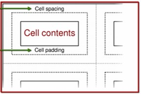

# The `<body>` Tag

The `<body>` tags contains all sorts of visible texts, lists, images, links, tables etc. within it.

Separate tags and syntax exists to add all these visible elements inside the `<body>` tags.

Some of the basic operations performed within the `<body>` tags are :

1. Sentence formatting
2. Text formatting
3. Adding Lists
4. Adding & formatting Images
5. Adding & formatting Videos
6. Adding & formatting Links
7. Adding & formatting tables

## Sentence Formatting

Sentence formatting includes

## The `<p>` Tags

The `<p>` tags creates the paragraph spacing between the lines of text.

*For example :*

```HTML
<p>
  It was the hunter's first time outside the forest. He was surprised to see the roads, the cars, the tall buildings and crowd surrounding him.
</p>

<p>
  Now it was dark and they heard a scream of a woman. They all were shocked because as per their knowledge the village is too far away for any voice to reach the middle of the jungle.
</p>
```

## The `<br>` Tag

The `<br>` tag don't have a closing tag and it simply breaks the line to start the next sentence on the next line.

Unlike the `<p>` tags, it don't creates a large spacing but, just creates a new line for the sentence.

*For example :*

```HTML
It was another day in the city and the hunter is still clueless.<br>
The door bell rang and someone outside started speaking in a gentle voice.<br>
The hunter was afraid and asked "Who are you ?"
```

## The `&nbsp;` Tag

HTML ignores the blank spaces between sentences and this is popularly known as the "*white space collapsing*" property.

So, spaces created by the *Tab Key, Enter Key* or, *Space bar* is basically ignored by HTML.

Therefore, to add empty spaces between sentences, we can use the keyword `&nbsp;` between two sentences.

`&nbsp;` stands for "*Non-Breaking Spaces*" and one such tag creates a single space (equivalent of tapping the *space bar* once).

If we want to have blank spaces equivalent of pressing the *Tab key* once then, we have to write `&nbsp;` for four times.

*For Example :*

```HTML
This marks the end of hunter's life. Hunter died as he can't cooperate with the city lifestyle but,what message he gave us is worth remembering.
&nbsp; &nbsp; &nbsp; &nbsp;  It was a new morning and the hunter found himself in his cottage but, now it looks a little different. There were flowers everywhere and birds were chippering outside.
```


## Text Formatting Tags

### Text Formatting With Tags

### Header Tags

The header tags are a set of six similar tabs that are used to add headers & sub-headers.

Each header tag has its corresponding ending tag and texts enclosed between these tags behave as a title for the document.

The six different header tags are as follows (in descending order of header size) :

`<h1> </h1>` :  Largest size
`<h2> </h2>` : Smaller size than `<h1>` tags
`<h3> </h3>` : Smaller size than `<h2>` tags
`<h4> </h4>` : Smaller size than `<h3>` tags
`<h5> </h5>` : Smaller size than `<h4>` tags
`<h6> </h6>` : Smallest size

*For Example :*
```HTML

<h1> Header 1 </h1>
<h2> Header 1 </h2>
<h3> Header 1 </h3>
<h4> Header 1 </h4>
<h5> Header 1 </h5>
<h6> Header 1 </h6>
```

#### The `<strong>` Tags

To make a text bold, we need to enclose that within the `<strong>` tags as follows :

*For Example :*

```HTML
The key character of the story is <strong> hunter </strong>.
```

#### The `<em>` Tags

To make a text italics, we need to enclose that within the `<em>` tags as follows :

*For Example :*

```HTML
Let's make this word <em> italics </em>.
```
#### The `<u>` Tags

To underline a text, we need to enclose it within the `<u>` tags as follows :

*For Example :*

```HTML
This is something very <u> important </u>
```

#### The `<strike>` Tags

To strikethrough a text, we need to enclose it within the `<strike>` tags as follows :

*For Example :*

```HTML
This task is completed so need to <strike> strikethrough </strike> this.
```

To Make a word bold, underlined and italics at the same time, we can enclose it within the respective three tags irrespective of any order but, the respective closing tags must follow the order of the opening tags.

*For Example :*

```HTML

Let's make this <em><strong><u> bold, italics & underlined  </em></strong></u>
```
### Inline Text Formatting with `<font>` tags

A much flexible way of text formatting is inline text formatting.

*For Example :*

with the following HTML syntax, we have made :
- Font type : Arial
- Font size : 24
- Font colour : Blue


```HTML
<font face = "arial"  size = "22" color = "blue"> This is the text </font>
```

## Creating Lists

List can be of two types, such as :

1. Unordered List
2. Ordered List

### Unordered List

The items in an unordered lists are in no particular order. To create an unordered list in HTML, we have to follow the syntactical rule of the following example.

*For Example :*

To create an unordered list of top BI tools :

```HTML
<ul>

  <li> Power BI </li>
  <li> Tableau </li>
  <li> Qlik </li>
  <li> MicroStrategy </li>

</ul>
```
### Ordered List

The items in an ordered lists are in a particular order and they are identifiable by a sequential order of numbers. To create an ordered list in HTML, we have to follow the syntactical rule of the following example.

*For Example :*

Listing out favourite subjects in descending order  :

```HTML
<ol>

  <li> Data Science </li>
  <li> Data Analytics </li>
  <li> Statistics </li>
  <li> Graphic Design </li>
  <li> Frontend Development </li>

</ol>
```
## Adding Images

The `` tag is used to add images in the web page. We need to follow the below syntactical rule to add an image :

```HTML

```

The `src` tag takes up the image address for rendering. Similarly, we can control the width and height of the image by `width` and `height` tag as follows :

```HTML

```
> If we don't provide the `height` tag then, the image will be auto-adjusted according to the width.


## Embedding Videos

The `<video>` tags is used to embed any video on the web page.

```HTML
<video width = "100%" controls>

  <source src="Relative/Absolute video address" type="video/mp4">
  Your video doesn't support the video tag

</video>
```

By setting `width = "100%"`, we made the video element to cover the entire screen width of browser. So, we can tweak this percentage as per our convenience.

We can also specify the `width` in pixels, such as, `width = "500"` and in this case, the video element will have a constant width irrespective of the browser screen width.

The `controls` element adds the "*Play*" and "*Progress bar*" to the video and we can remove it if we need.

But, after removing the `controls` element,  we need to add another element, i.e., `autoplay` otherwise, the video will not play.

> Note : `autoplay` doesn't support in most of the mobile devices like iPhone and iTab etc.

The `src` and `type` tag takes up the video address and video type respectively for rendering.

## Adding Links

The `<a>` tags are used to add links in the web page.

Links can be of two types :

- Textual Links
- Image Links

### Textual Links :

To add textual links in the web page, we can follow the syntactical rule given in this example :

*For Example :*

Adding a link for the Wikipedia page :

```HTML
<a href= "https://www.wikipedia.org/"> Wikipedia Page </a>
```

In the above example, we have added the link to the text "Wikipedia Page".

To open the link in a new tab (or, a new browser window), we need to add `target="_blank"` argument in the opening `<a>` tag, as follows :

```HTML
<a href= "https://www.wikipedia.org/" target="_blank"> Wikipedia Page </a>
```


### Image Links :

We can add links to the images as well, as follows :

```HTML
<a href="https://www.wikipedia.org/" target="_blank">
  
</a>
```
Through Image links, the user can navigate to the provided link by clicking on the image.

## Adding Tables

The `<table>` tags are used to add tables in the web page.

We can add a table in the web page by following the syntactical approach given in the below example :

```HTML
<table width="50%" border="1" bordercolor="blue" cellspacing="2" cellpadding = "2">
  <tr>
    <td> Sports </td>
    <td> Responses </td>
  </tr>
  <tr>
    <td> Basketball </td>
    <td> 25 </td>
  </tr>
  <tr>
    <td> Baseball </td>
    <td> 28 </td>
  </tr>
</table>
```

- `<tr>` tags add a row to the table
- `<td>` tags add column to the table

The opening `<table>` tag also takes several attributes to format the table as well and they are as follows :

- `width = 50%` : Table covers 50% of browser width, to have a fixed table width irrespective of any browser width, we can specify the pixels instead of percentages. For example : `width = "500"`

- `border="1"` : Sets the border thickness, to have a table without any borders, we can set `border = "0"`.

- `bordercolor="blue"` : Sets the color of the table border to "Blue".

- `cellspacing="2"` : Sets the space between two consecutive cells to "2" pixels

- `cellpadding = "2"` : Pads the number 2 pixels away from each side of its cell.

The below image illustrates the cell-spacing and cell-padding in a table :



### Nested Tables :

We can also create nested tables by adding the child-tables into the cells of parent table.

The width of the child table will always remain relative to its parent table only.

If the fixed width assigned to the child-table is greater than the fixed with assigned to the parent table then, the parent-table width becomes equal to the child-table width.

So, we can say, in no way, the child-table overflows out of the parent table.

The following example creates two side by side child tables :

```HTML
<table width="50%" border="1" bordercolor="red" cellspacing="2" cellpadding = "2">
  <tr>

    <td>
      <table width="100%" border="1" bordercolor="blue" cellspacing="2" cellpadding = "2">
        <tr>
          <td> Sports </td>
          <td> Responses </td>
        </tr>
        <tr>
          <td> Basketball </td>
          <td> 25 </td>
        </tr>
        <tr>
          <td> Baseball </td>
          <td> 28 </td>
        </tr>
      </table>
    </td>

    <td>
    <table width="100%" border="1" bordercolor="blue" cellspacing="2" cellpadding = "2">
      <tr>
        <td> Sports </td>
        <td> Responses </td>
      </tr>
      <tr>
        <td> Football </td>
        <td> 40 </td>
      </tr>
      <tr>
        <td> Cricket </td>
        <td> 45 </td>
      </tr>
    </table>
  </td>

  </tr>
</table>
```

### Merging Cells

We can merge the cells of a table by adding an attribute, `colspan = "no. of rows/columns to merge"` to the `<td>` tabs (for merging by columns) or, `<tr>`tabs (for merging by rows).

The following example, merges two side by side column headers of a `(3 x 2)` table :

```HTML
<table width="50%" border="1" bordercolor="black" cellspacing="2" cellpadding="2">
  <tr>
    <td colspan="2"> My Expenses </td>
  </tr>
  <tr>
    <td> January </td>
    <td> $500 </td>
  </tr>
  <tr>
    <td> February </td>
    <td> $200 </td>
  </tr>
  <tr>
    <td> March </td>
    <td> $300 </td>
  </tr>
  <tr>
    <td> Total </td>
    <td> $1000 </td>
  </tr>
</table>
```
### Text Wrapping in Cells

By default, the HTML tables wraps up the cell content if it is long enough to be accommodated within the specified cell width but; if we don't want to wrap our texts then, we can add an additional attribute, `nowrap` to do so.

In the following example, `nowrap` is applied to the column header :

```HTML
<table width="200" border="1" bordercolor="black" cellspacing="2" cellpadding="2">
  <tr>
    <td colspan="2" nowrap> My expenses in the 1st two motnths of Q1-2020 is as follows : </td>
  </tr>
  <tr>
    <td> January </td>
    <td> $500 </td>
  </tr>
  <tr>
    <td> February </td>
    <td> $200 </td>
  </tr>
</table>
```

> ***Note :*** `nowrap` attribute overwrites the specified table width.

### Text Alignments in Cells

The cell contents can be aligned to left, right, centre or, justify by using the following attributes :

- `align = "right"`- For right alignment
- `align = "left"` - For left alignment
- `align = "center"` - For centre alignment

In the following example, the column headers and "Expenses" column ins centre aligned whereas, the "Month" column is left aligned :

```HTML
<table width="30%" border="1" bordercolor="black" cellspacing="2" cellpadding="2">
  <tr>
    <td align="center"> Month </td>
    <td align="center"> Expenses </td>
  </tr>
  <tr>
    <td align="left"> January </td>
    <td align="center"> $500 </td>
  </tr>
  <tr>
    <td align="left"> February </td>
    <td align="center"> $200 </td>
  </tr>
  <tr>
    <td align="left"> March </td>
    <td align="center"> $300 </td>
  </tr>
</table>
```

## Table Background

With the help of `background` attribute, we can set any colour or, image as the background of the whole table or, for some specific column/row/cell as well.

The following example shows, how to add a specific colour as the table background :

```HTML
<table width="30%" border="1" background="Image URL">
  <tr>
    <td align="center"> Month </td>
    <td align="center"> Expenses </td>
  </tr>
  <tr>
    <td align="left"> January </td>
    <td align="center"> $500 </td>
  </tr>
  <tr>
    <td align="left"> February </td>
    <td align="center"> $200 </td>
  </tr>
  <tr>
    <td align="left"> March </td>
    <td align="center"> $300 </td>
  </tr>
</table>
```

similarly, we can apply the background image just to the column headers as follows :

```HTML
<table width="30%" border="1">
  <tr background="Image URL">
    <td align="center"> Month </td>
    <td align="center"> Expenses </td>
  </tr>
  <tr>
    <td align="left"> January </td>
    <td align="center"> $500 </td>
  </tr>
  <tr>
    <td align="left"> February </td>
    <td align="center"> $200 </td>
  </tr>
  <tr>
    <td align="left"> March </td>
    <td align="center"> $300 </td>
  </tr>
</table>
```
